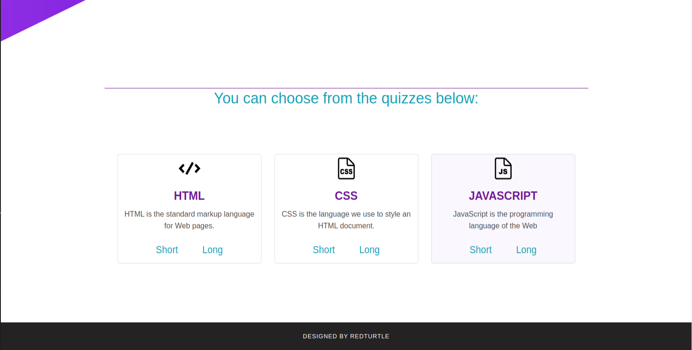
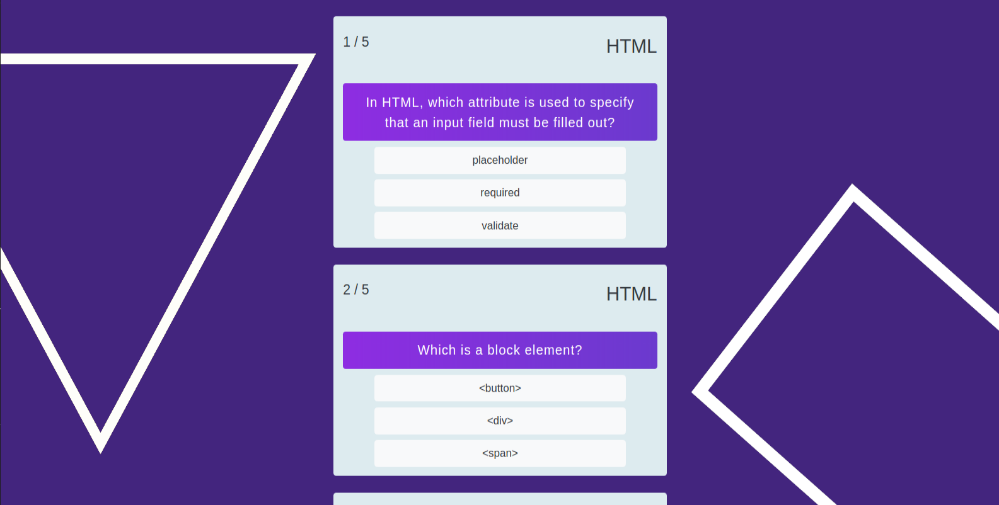
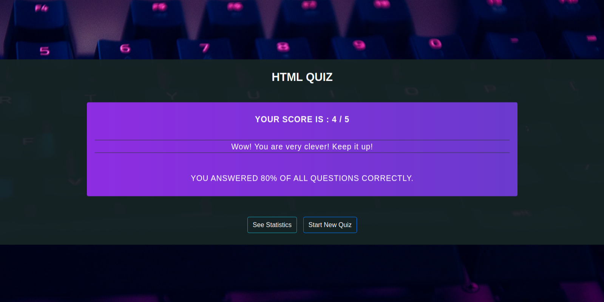
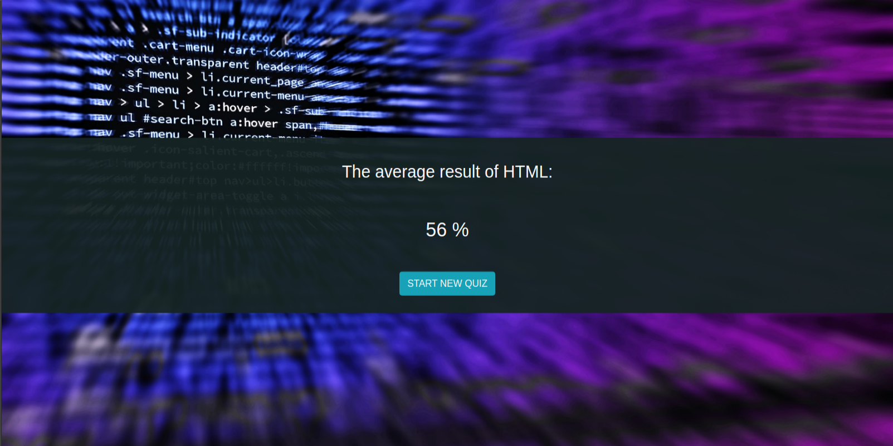

# IT-Quiz-Website with Mysql or MongoDb
Used for this project:
* Both relational and NoSql databases
    *   KnexJs with MySQL driver
    *   Pure MongoDb
* Handlebars templating engine
* Nodemon for live reload
* .env file to hold environment variables that will be injected
* migration and seed files
    
#### You can choose which database would you like to use. Mysql or MongoDb?
#### It' up to you. The result will be the same.

## Setup with Mysql
```sh
git clone git@github.com:Redturtle42/Quiz-website.git
```
### Dependencies
This project requires a running MySQL instance. If you don't have one set up locally, you can start always a Docker container by the following command:
```sh
docker run --name <container-name> -p 3306:3306 -e MYSQL_ROOT_PASSWORD=<root user's password> -d mysql
```

### Database
You have to create a database to serve your application:
```sh
docker exec -it <container-name> mysql -p

"CREATE DATABASE <database-name>";

ALTER USER 'root'@'%' IDENTIFIED WITH mysql_native_password BY 'root';

FLUSH PRIVILEGES;

USE DATABASE <database-name>;
```

### Configuration
You can find a .env.template file that you have to fill out to fit your needs.
After you're done, **rename** it to **.env**

### Dependencies
To download all dependencies type the following to console:
```sh
npm install
```

### Knex
To fill the database with records:
```sh
knex migrate:latest

knex seed:run
```

## Start application
`DB=mysql npm start`

## Let's some quiz!
Open http://localhost:3005

---------------------------------------------------------------------------------

## Setup with MongoDb
```sh
git clone git@github.com:Redturtle42/Quiz-website.git
```
### Dependencies
This project requires a running MySQL instance. If you don't have one set up locally, you can start always a Docker container by the following command:
```sh
docker-compose up -d
```

### Database
You have to create a database to serve your application:
```sh
docker exec -it mongo-quiz bash

mongo

use admin

db.createUser({user:"admin", pwd:"root", roles:["root"]});

use quiz

db.createUser({user:"root", pwd:"quiz", roles:[{role:"readWrite", db:"quiz"}]});

exit
```

In the docker-compose.yml file uncomment the following line:
```sh
#command: [--auth]
```
After that go back to the therminal inside the Docker:
```sh
mongo -u root -p quiz --authenticationDatabase quiz
use quiz
```

### Dependencies
To download all dependencies type the following to another console:
```sh
npm install
```

### Migration
To fill the database with records:
```sh
cd albums-migrations

migrate-mongo up

cd ..
```

## Start application
`DB=mongo npm start`

## Let's some quiz!
Open http://localhost:3005






