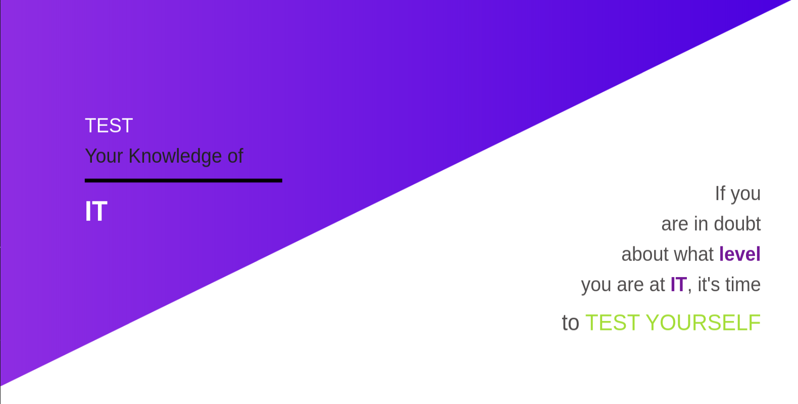

# IT-Quiz-Website
Used for this project:
* Handlebars templating engine
* KnexJs with MySQL driver
* Nodemon for live reload
* .env file to hold environment variables that will be injected
* migration and seed files
    
## Setup
### Dependencies
This project requires a running MySQL instance. If you don't have one set up locally, you can start always a Docker container by the following command:
```sh
docker run --name <container-name> -p 3306:3306 MYSQL_ROOT_PASSWORD=<root user's password> -d mysql
```

### Database
You have to create a database to serve your application:
```sh
docker exec -it <container-name> mysql -p

"CREATE DATABASE <database-name>";

ALTER USER 'root'@'%' IDENTIFIED WITH mysql_native_password BY 'root';

FLUSH PRIVILEGES;

USE DATABASE <database-name>;
```

### Configuration
You can find a .env.template file that you have to fill out to fit your needs.
After you're done, **rename** it to **.env**

### Dependencies
To download all dependencies type the following to console:
```sh
npm install
```

### Knex
To fill the database with records:
```sh
knex migrate:latest

knex seed:run
```

## Start application
`npm start`

## Let's some quiz!
Open http://localhost:3004




